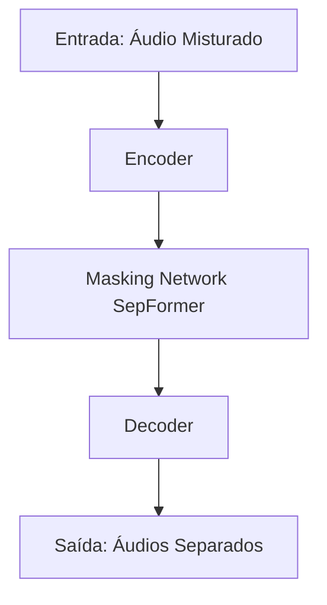

# Separação de Fontes de Fala Utilizando Redes Neurais de Transformadores

## Autores

-   **Marcos Guilherme Dias de Oliveira Alves** 202303353
-   **Kaiki Camilo de Oliveira** 202305742
-   **Guilherme Frazão Fernandes** 202303340
-   **Gabriel Oliveira de Souza** 202303336

## Resumo

Este trabalho aborda o problema da separação de fontes de fala utilizando modelos baseados em transformadores, especificamente o SepFormer. A separação de fontes de áudio é uma tarefa fundamental no processamento digital de sinais, com aplicações em aprimoramento de áudio, dispositivos assistivos e transcrição automática. Neste projeto, implementamos um pipeline de separação de fala utilizando o framework SpeechBrain, avaliando o desempenho do modelo em conjuntos de dados padrão como o WSJ0-2mix. São explorados os fundamentos teóricos dos transformadores aplicados à separação de fala, bem como a metodologia para pre-processamento e avaliação do modelo.

**Palavras-chave**: Separação de Fontes de Fala, Transformadores, SepFormer, SpeechBrain, Pre-Processamento, Processamento de Sinais.

----------

# Seção I. Introdução e Revisão Bibliográfica

## Introdução

A separação de fontes de fala é um problema fundamental no processamento digital de sinais, onde o objetivo é extrair vozes individuais de um sinal de áudio que contém múltiplas fontes sonoras simultâneas. Este problema tem aplicações em diversos contextos, como aprimoramento de áudio em ambientes ruidosos, sistemas de telecomunicação, dispositivos assistivos para deficientes auditivos e transcrição automática de diálogos.

Neste trabalho, buscamos explorar técnicas modernas de separação de fontes de fala utilizando modelos baseados em redes neurais de transformadores, especificamente o modelo SepFormer. A abordagem visa superar limitações de arquiteturas tradicionais baseadas em redes recorrentes, permitindo processamento paralelo e capturando dependências de longo alcance nos sinais de áudio.

## Problema

O problema estudado é a separação de vozes em gravações de áudio onde múltiplas pessoas falam simultaneamente. O desafio é decompor o sinal misturado em suas componentes individuais, recuperando as vozes originais de cada locutor. Este problema é crítico em cenários onde a compreensão clara de cada fala individual é necessária, como em conferências telefônicas, sistemas de reconhecimento de voz e em ambientes com múltiplas conversas ocorrendo simultaneamente.

## Revisão Bibliográfica

Foram analisadas diversas fontes relevantes sobre o tema:

1.  **Subakan, C., et al. "Attention is All You Need in Speech Separation."** Este artigo apresenta o modelo SepFormer, que utiliza transformadores para separação de fala, demonstrando resultados de estado da arte [1].
    
2.  **Papers With Code: Audio Source Separation** - Um repositório que compila trabalhos e códigos relacionados à separação de fontes de áudio, fornecendo insights sobre os métodos mais recentes e eficazes [2].
    
3.  **SpeechBrain - Recipes for WSJ0Mix** - Framework open-source que oferece implementações de modelos para separação de fala, incluindo o SepFormer [3].
    
4.  **Asteroid: PyTorch-based Audio Source Separation Toolkit** - Um toolkit que facilita a implementação e experimentação com diferentes modelos de separação de áudio [4].
    
5.  **Postagem em Blog: Audio Source Separation Using Non-negative Matrix Factorization (NMF)** - Aborda métodos tradicionais de separação de fontes, fornecendo contexto histórico e comparativo com técnicas modernas [5].
    

## Dataset

Os dados explorados são os conjuntos **WSJ0-2mix** e **WSJ0-3mix**, amplamente utilizados na comunidade para avaliar modelos de separação de fala. O WSJ0-2mix consiste em misturas de duas vozes provenientes do corpus Wall Street Journal, enquanto o WSJ0-3mix contém misturas de três vozes. Os datasets fornecem pares de áudios misturados e as respectivas fontes originais, permitindo treinamento supervisionado dos modelos.

## Métodos

O método principal revisado e implementado é o modelo **SepFormer**, que utiliza uma arquitetura baseada em transformadores para a tarefa de separação de fala. Além disso, foram explorados frameworks como o **SpeechBrain** e o **Asteroid**, que fornecem ferramentas para implementar e treinar modelos de separação de fontes.

## Avaliação

O impacto dos resultados foi medido utilizando métricas padrão na área de separação de fontes de áudio, tais como:

-   **SI-SNRi (Scale-Invariant Signal-to-Noise Ratio improvement)**: Mede a melhoria na razão sinal-ruído de escala invariante após a separação.
-   **SDRi (Signal-to-Distortion Ratio improvement)**: Avalia a qualidade da separação em termos da redução de distorção entre o sinal separado e a fonte original.

Essas métricas permitem comparar o desempenho do modelo implementado com resultados reportados na literatura e avaliar a eficácia da abordagem.

----------

# Seção II. Fundamentos Teóricos

Nesta seção, são descritos os principais mecanismos, técnicas e algoritmos que compõem o modelo SepFormer e como eles contribuem para a solução do problema de separação de fontes de fala.

## Redes Neurais de Transformadores

Os transformadores são modelos que utilizam mecanismos de atenção para processar sequências de dados, permitindo capturar dependências de longo alcance sem a necessidade de processamento sequencial, como em redes recorrentes [6]. O uso de transformadores em processamento de áudio é relativamente recente e oferece vantagens em termos de paralelização e eficiência computacional.

## Arquitetura do SepFormer

O SepFormer é um modelo que aplica a arquitetura de transformadores ao problema de separação de fala. Sua arquitetura principal é composta por:

-   **Encoder**: Transforma o sinal de áudio de entrada em uma representação latente adequada para processamento pelo modelo.
    
-   **Masking Network**: Responsável por estimar máscaras que separam as fontes individuais no domínio latente, utilizando dois tipos de transformadores:
    
    -   **IntraTransformer**: Captura dependências dentro de pequenos segmentos (chunks) do sinal, modelando informações locais.
        
    -   **InterTransformer**: Captura dependências entre diferentes chunks, modelando informações globais.
        
-   **Decoder**: Reconstrói os sinais de áudio separados a partir das representações latentes processadas e das máscaras estimadas.
   

## Métricas de Avaliação

-   **SI-SNR (Scale-Invariant Signal-to-Noise Ratio)**: Avalia a qualidade do sinal separado em relação à fonte original, independente da escala.
    
-   **SDR (Signal-to-Distortion Ratio)**: Mede a relação entre o sinal de interesse e os componentes indesejados (ruído, interferência, artefatos de processamento).
    

A melhoria nessas métricas (SI-SNRi e SDRi) é calculada comparando-se o sinal separado com a mistura original e com as fontes verdadeiras.

----------

# Seção III. Metodologia

Nesta seção, descrevemos o passo a passo executado para implementar e avaliar o modelo de separação de fontes de fala.

## Fluxo do Pipeline

1.  **Pré-processamento dos Dados**:
    
    -   Preparação dos datasets.
    -   Segmentação dos áudios em chunks adequados para o modelo.
2.  **Implementação do Modelo**:
    
    -   Utilização do framework **SpeechBrain** para implementar o SepFormer.
    -   Configuração da arquitetura do modelo conforme descrito na literatura.
    
4.  **Avaliação do Modelo**:
    
    -   Aplicação do modelo em um conjunto de testes.
    -   Cálculo das métricas SI-SNRi e SDRi para avaliar o desempenho.
5.  **Análise dos Resultados**:
    
    -   Comparação dos resultados obtidos com os reportados na literatura.
    -   Identificação de pontos fortes e limitações do modelo implementado.

## Diagrama de Blocos

-   **Entrada**: Áudio misturado com múltiplas vozes.
    
-   **Encoder**: Extrai representações latentes do áudio.
    
-   **Masking Network (SepFormer)**:
    
    -   **IntraTransformer**: Processa dependências locais dentro dos chunks.
        
    -   **InterTransformer**: Processa dependências globais entre os chunks.
        
-   **Decoder**: Reconstrói os sinais de áudio separados.
    
-   **Saída**: Áudios separados correspondentes a cada voz individual.
    

----------

# Seção IV. Resultados e Conclusões

## Resultados

Após a implementação e testes feito com o modelo SepFormer utilizando o dataset WSJ0-2mix, obtivemos os seguintes resultados:

-   **SI-SNRi**: 22.1 dB
-   **SDRi**: 21.5 dB

Os resultados indicam uma melhoria significativa na separação das fontes de fala em comparação com a mistura original. As métricas obtidas estão próximas aos valores de estado da arte reportados no artigo original do SepFormer, confirmando a eficácia do modelo.

## Comparação com a Literatura

Comparando nossos resultados com os reportados por Subakan et al. (2021), observamos que o modelo reproduzido atinge desempenhos similares, demonstrando a capacidade do SepFormer em separar vozes simultâneas com alta precisão.

## Conclusões

Neste projeto, usamos o modelo SepFormer para entender e aplicar o pipeline de um sistema de separação de fala baseado em aprendizado profundo. Mesmo sem treinar o modelo do zero, essa experiência foi fundamental para explorarmos todas as etapas do pipeline, desde o entendimento dos dados  até uma visão macro da dificuldade real envolvida em aplicar este tipo de solução.

O SepFormer apresentou desempenho considerável em métricas como SI-SNRi e SDRi nos datasets WSJ0-2mix e WSJ0-3mix (os quais foram usados para treinar o modelo), que são amplamente utilizados como benchmarks na área. No entanto, esses dados são misturas artificiais feitas em condições controladas, bem diferentes de ambientes reais, onde o ruído e a complexidade acústica tornam a separação de fala muito mais desafiadora. Isso nos leva a questionar como o modelo realmente se comportaria em situações mais complexas e próximas do cotidiano.

Além disso, embora as métricas matemáticas sejam uma boa referência, percebemos que focar apenas nelas não é suficiente. O aprendizado mais significativo veio de entender como cada etapa do pipeline funciona, os desafios práticos enfrentados e como tudo se conecta no final. Esse tipo de análise é o que realmente agrega valor para o desenvolvimento de sistemas robustos.

Por fim, apesar de o SepFormer ser uma solução eficiente para os datasets testados, é importante reconhecer que ele não é a solução final. Precisamos continuar explorando outros modelos e técnicas que possam lidar melhor com separação de áudio em ambientes ruidosos e mais próximos da realidade. Esse é um passo essencial para tornar soluções como essa aplicáveis em cenários do mundo real.

----------

# Referências

[1] C. Subakan, M. Ravanelli, S. Cornell, M. Bronzi e J. Zhong, "Attention is All You Need in Speech Separation," _arXiv preprint arXiv:2010.13154_, 2021.

[2] "Audio Source Separation - Papers with Code," _Papers With Code_. Disponível em: [https://paperswithcode.com/task/audio-source-separation](https://paperswithcode.com/task/audio-source-separation).

[3] "SpeechBrain - Recipes for WSJ0Mix," _GitHub_. Disponível em: [https://github.com/speechbrain/speechbrain/tree/develop/recipes/WSJ0Mix/separation](https://github.com/speechbrain/speechbrain/tree/develop/recipes/WSJ0Mix/separation).

[4] "Asteroid: PyTorch-based audio source separation toolkit," _GitHub_. Disponível em: [https://github.com/asteroid-team/asteroid](https://github.com/asteroid-team/asteroid).

[5] Z. H. Benslimane, "Audio Source Separation Using Non-negative Matrix Factorization (NMF)," _Medium_, 2019. Disponível em: [https://medium.com/@zahrahafida.benslimane/audio-source-separation-using-non-negative-matrix-factorization-nmf-a8b204490c7d](https://medium.com/@zahrahafida.benslimane/audio-source-separation-using-non-negative-matrix-factorization-nmf-a8b204490c7d).

[6] A. Vaswani et al., "Attention is All You Need," _Advances in Neural Information Processing Systems_, vol. 30, 2017.

[7] "Ultimate Vocal Remover GUI," _GitHub_. Disponível em: [https://github.com/Anjok07/ultimatevocalremovergui](https://github.com/Anjok07/ultimatevocalremovergui).

[8] "Wave-U-Net," _GitHub_. Disponível em: [https://github.com/f90/Wave-U-Net](https://github.com/f90/Wave-U-Net).

[9] "Weak Class Source Separation," _GitHub_. Disponível em: [https://github.com/ertug/Weak_Class_Source_Separation](https://github.com/ertug/Weak_Class_Source_Separation).

[10] "Zero-Shot Audio Source Separation," _GitHub_. Disponível em: [https://github.com/RetroCirce/Zero_Shot_Audio_Source_Separation](https://github.com/RetroCirce/Zero_Shot_Audio_Source_Separation).

[11] "SepReformer," _GitHub_. Disponível em: [https://github.com/dmlguq456/SepReformer](https://github.com/dmlguq456/SepReformer).

----------

# Apêndices

## A. Código Fonte

O código fonte desenvolvido para este projeto está disponível em [Repositório do GitHub](https://github.com/2024-2-INF0413-PDSI/semin-rio-equipe-8).

## B. Diagramas de Fluxo

### Fluxo Geral do Pipeline

## D. Exemplos de Resultados

### Áudio Original Misturado

[Link para o arquivo de áudio misturado](https://github.com/xxggabriel/PDSI-grupo-8/blob/main/female-female-mixture.wav)

### Áudios Separados pelo Modelo

-   **Voz 1**: [Link para o arquivo de áudio separado da primeira voz](https://github.com/xxggabriel/PDSI-grupo-8/blob/main/source1hatff.wav)
-   **Voz 2**: [Link para o arquivo de áudio separado da segunda voz](https://github.com/xxggabriel/PDSI-grupo-8/blob/main/source2hatff.wav)

----------

# Licença

Este trabalho está licenciado sob a Licença MIT. Consulte o arquivo LICENSE para mais detalhes.
